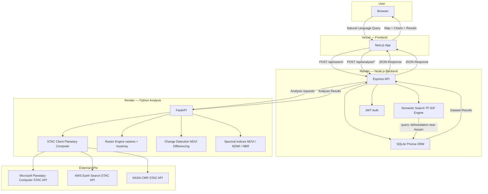
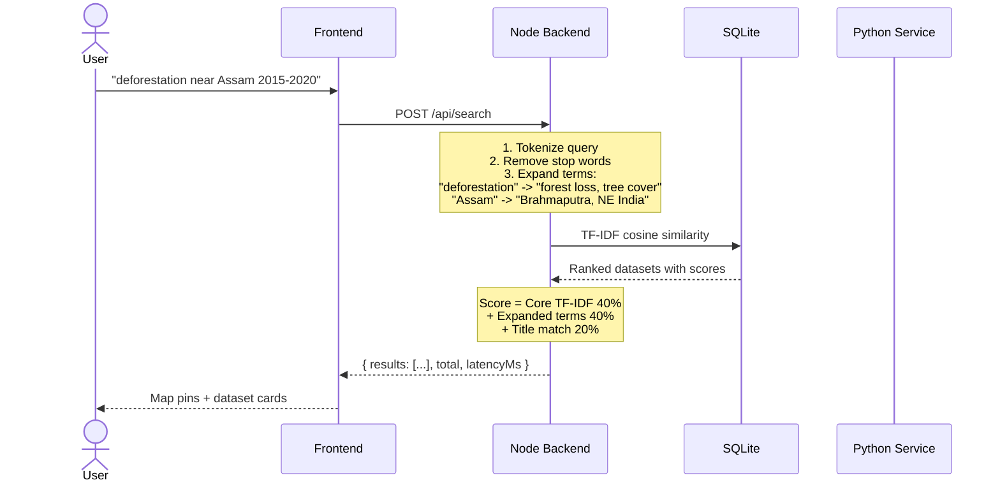
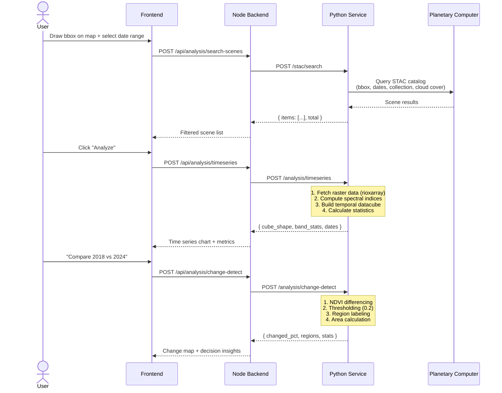
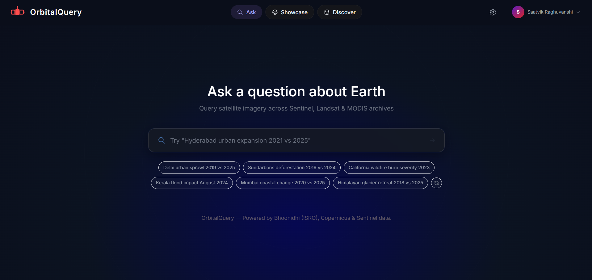
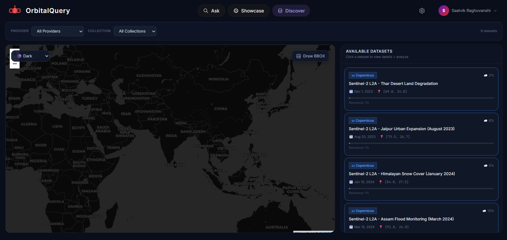

# OrbitalQuery — Semantic EO Dataset Explorer

A platform that enables researchers and decision-makers to **semantically query Earth Observation (EO) datasets** using natural language, geospatial filters, and time ranges. Combines semantic AI search with GIS visualization to make EO archives accessible without manual browsing.


---

OrbitalQuery is a semantic search engine for Earth Observation satellite datasets that lets researchers query archives using natural language (e.g., "deforestation near Assam 2015-2020") instead of manually browsing STAC catalogs — and unlike competitors like STAC Browser or Sentinel Hub, it combines AI-powered semantic search with a full analysis pipeline (temporal comparison, change detection, spectral indices) in a single zero-config platform, so you go from question to insight without switching tools.

> **Disclaimer:** OrbitalQuery is a research and exploration tool. It is **not intended for operational disaster response** or mission-critical decision-making. Always verify dataset accuracy and suitability through official sources before making policy or operational decisions.

---

## Working Links

### Local Development

| Service | URL | Description |
|---------|-----|-------------|
| **Frontend (UI)** | http://localhost:3000 | Main application — search bar, map, results |
| **Backend (API)** | http://localhost:3001 | REST API — search, auth, datasets |
| **Backend API Docs** | http://localhost:3001/ | API documentation landing page |
| **Full Stack** | http://localhost:3000 | Frontend proxies API calls to backend |

### GitHub Repository

| Link | URL |
|------|-----|
| **Repository** | https://github.com/saatvikraghuvanshi-lab/OrbitalQuery |
| **Main Branch** | https://github.com/saatvikraghuvanshi-lab/OrbitalQuery/tree/main |
| **Stage 1 (Prototype)** | https://github.com/saatvikraghuvanshi-lab/OrbitalQuery/tree/stage-1 |
| **Stage 2 (Enhancement)** | https://github.com/saatvikraghuvanshi-lab/OrbitalQuery/tree/stage-2 |
| **Stage 3 (Dashboard)** | https://github.com/saatvikraghuvanshi-lab/OrbitalQuery/tree/stage-3 |

### API Endpoints (all verified working)

| Endpoint | Method | URL | Status |
|----------|--------|-----|--------|
| Health Check | GET | http://localhost:3001/api/health | Verified |
| Semantic Search | POST | http://localhost:3001/api/search | Verified |
| List Providers | GET | http://localhost:3001/api/search/providers | Verified |
| List Collections | GET | http://localhost:3001/api/search/collections | Verified |
| List Datasets | GET | http://localhost:3001/api/datasets | Verified |
| Dataset Stats | GET | http://localhost:3001/api/datasets/stats/overview | Verified |
| Register User | POST | http://localhost:3001/api/auth/register | Verified |
| Login | POST | http://localhost:3001/api/auth/login | Verified |
| Get Profile | GET | http://localhost:3001/api/auth/me | Verified |

---

## Product Preview

<!--
PRODUCT SCREENSHOT PLACEHOLDER
Add OrbitalQuery product overview screenshot here.
Suggested asset: docs/screenshots/orbitalquery-overview.png
-->

<!--
ASK INTERFACE PLACEHOLDER
Add Ask interface screenshot here.
Suggested asset: docs/screenshots/orbitalquery-ask.png
-->

<!--
EXPLORE INTERFACE PLACEHOLDER
Add Explore interface screenshot here.
Suggested asset: docs/screenshots/orbitalquery-explore.png
-->

<!--
DATASETS INTERFACE PLACEHOLDER
Add Datasets interface screenshot here.
Suggested asset: docs/screenshots/orbitalquery-datasets.png
-->

<!--
ANALYSIS INTERFACE PLACEHOLDER
Add Analysis interface screenshot here.
Suggested asset: docs/screenshots/orbitalquery-analysis.png
-->

<!--
BEFORE/AFTER ANALYSIS PLACEHOLDER
Add Before/After satellite comparison screenshot here.
Suggested asset: docs/screenshots/orbitalquery-before-after.png
-->

<!--
CHANGE DETECTION PLACEHOLDER
Add Change Detection screenshot here.
Suggested asset: docs/screenshots/orbitalquery-change-detection.png
-->

---

## Features

### Semantic Search
Query datasets using natural language (e.g., "deforestation near Assam 2015-2020"). The search engine tokenizes queries, removes stop words, expands terms, and ranks results using TF-IDF cosine similarity.

### Interactive Map
Leaflet.js map with dataset footprints, satellite imagery basemap, and bounding box drawing for spatial filtering.

### Temporal Filtering
Filter by date ranges to find time-specific imagery across years of satellite observations.

### Multi-Source Dataset Discovery
Search across Sentinel-2, Landsat-8/9, Sentinel-1, MODIS, VIIRS, and NAIP collections from multiple providers.

### Ranked Results
Results ranked by relevance scores combining TF-IDF similarity, expanded term matching, and title weighting.

### Spatial Filtering
Draw bounding boxes on the map to filter datasets by geographic region.

### Temporal Comparison
Compare satellite observations across time periods with before/after visualization, swipe comparison, and difference maps.

### Spectral Indices
Compute NDVI, NDWI, NDBI, NBR, and NDSI from real Sentinel-2 band assets using rasterio and NumPy.

### Change Detection
Pixel-level difference analysis with configurable thresholds, connected-component region labeling, and area statistics.

### Authentication
JWT-based user authentication with role-based access control (researcher, admin).

### Security
Rate limiting, input sanitization, Helmet headers, CORS hardening, and production error handling.

### Standalone / Mock Mode
Frontend works standalone with mock data when backend is offline.

---

## Quick Start

No API keys, no external database, no complex setup. Just Node.js.

### Prerequisites
- Node.js 18+ (`node --version`)
- npm (`npm --version`)

### 1. Install and Run

```bash
# Clone
git clone https://github.com/saatvikraghuvanshi-lab/OrbitalQuery.git
cd OrbitalQuery

# Install backend
cd backend && npm install && cd ..

# Install frontend
cd frontend && npm install && cd ..

# Start backend (Terminal 1)
cd backend && npm run dev

# Start frontend (Terminal 2)
cd frontend && npm run dev
```

### 2. Open the App

- **Frontend**: http://localhost:3000
- **Backend API**: http://localhost:3001/api/health

### 3. Load Real Data (216+ datasets from live STAC APIs)

```bash
# Ingest 216 real datasets from AWS Earth Search (Sentinel-2, Landsat, Sentinel-1, NAIP)
cd backend && npx ts-node src/scripts/ingest-real.ts --all --limit 50

# Or load sample data (16 curated datasets)
cd backend && npx ts-node src/scripts/ingest-sample.ts
```

### 4. Try It Out

Open http://localhost:3000 and click any demo query:
- "Deforestation near Assam 2015-2020"
- "Urban expansion in Jaipur"
- "Glacier retreat in Himalayas"
- "Ocean temperature Indian Ocean"

---

## How to Run

### Backend

```bash
cd backend
npm install
npm run dev
# Server starts on http://localhost:3001
# Verify: curl http://localhost:3001/api/health
```

### Frontend

```bash
cd frontend
npm install
npm run dev
# Server starts on http://localhost:3000
# Frontend auto-enables mock mode if backend is down
```

### Full Stack

```bash
# Terminal 1: Backend
cd backend && npm run dev

# Terminal 2: Frontend
cd frontend && npm run dev

# Open http://localhost:3000
# Frontend proxies /api/* calls to backend on port 3001
```

---

## Load Data

### Ingest from Live STAC APIs

```bash
# Ingest 216 real datasets from AWS Earth Search
cd backend && npx ts-node src/scripts/ingest-real.ts --all --limit 50

# Ingest specific collections
cd backend && npx ts-node src/scripts/ingest-real.ts --collection sentinel-2-l2a --limit 50
cd backend && npx ts-node src/scripts/ingest-real.ts --collection landsat-c2-l2 --limit 50
cd backend && npx ts-node src/scripts/ingest-real.ts --collection sentinel-1-grd --limit 50
```

### Load Sample Data

```bash
# Load 16 curated sample datasets
cd backend && npx ts-node src/scripts/ingest-sample.ts
```

---

## Authentication

### Register

```bash
curl -X POST http://localhost:3001/api/auth/register \
  -H "Content-Type: application/json" \
  -d '{"email": "researcher@university.edu", "password": "securepass123", "name": "Dr. Smith"}'
```

### Login

```bash
curl -X POST http://localhost:3001/api/auth/login \
  -H "Content-Type: application/json" \
  -d '{"email": "researcher@university.edu", "password": "securepass123"}'
```

### Use Token

```bash
curl -X GET http://localhost:3001/api/auth/me \
  -H "Authorization: Bearer YOUR_JWT_TOKEN"
```

### Roles

| Role | Permissions |
|------|------------|
| **researcher** | Search datasets, view results (default) |
| **admin** | Also trigger data ingestion and build embeddings |

---

## API Reference

### POST /api/search

**Request:**
```json
{
  "query": "deforestation near Assam",
  "bbox": [91.0, 26.0, 92.5, 27.5],
  "startDate": "2020-01-01",
  "endDate": "2024-12-31",
  "provider": "Copernicus/ESA",
  "limit": 20
}
```

**Response:**
```json
{
  "results": [...],
  "total": 5,
  "limit": 20,
  "offset": 0,
  "latencyMs": 8
}
```

### POST /api/analysis/temporal-compare

**Request:**
```json
{
  "query": "Hyderabad urban expansion 2021 vs 2025"
}
```

**Response:**
```json
{
  "plan": { "phenomenon": "urban_expansion", "analysis_type": "ndbi_change", ... },
  "result": { "scene_t1": {...}, "scene_t2": {...}, "metrics": {...}, ... },
  "processing_steps": [...]
}
```

---

## Semantic Search Engine

| Step | Description |
|------|-------------|
| 1 | Tokenize query, remove stop words |
| 2 | Expand terms: "deforestation" becomes "forest loss, tree cover, vegetation loss" |
| 3 | Geographic expansion: "Himalayas" becomes "glacier, snow cover, Nepal" |
| 4 | TF-IDF cosine similarity against dataset corpus |
| 5 | Title matches weighted 1.5x higher |
| 6 | Combined: Core TF-IDF (40%) + Expanded (40%) + Title (20%) |

---

## Data Sources

### Live Datasets (ingested from AWS Earth Search STAC API)

| Collection | Resolution | Provider | Coverage |
|-----------|-----------|----------|----------|
| sentinel-2-l2a | 10m multispectral | Copernicus/ESA | Global, 5-day revisit |
| landsat-c2-l2 | 30m multispectral | USGS/NASA | Global, 16-day revisit |
| sentinel-1-grd | 10m SAR | Copernicus/ESA | Global, 6-day revisit |
| naip | 0.6m aerial | USDA | USA only |

### Additional Sources Available

| Source | Resolution | Provider |
|--------|-----------|----------|
| MODIS Terra/Aqua | 1km | NASA |
| VIIRS DNB | 500m | NASA |
| Sentinel-3 SLSTR | 1km | Copernicus/ESA |

### Trusted Data Sources

| Source | API | Role in OrbitalQuery | Status |
|--------|-----|---------------------|--------|
| **Microsoft Planetary Computer** | STAC + TileJSON | Temporal analysis, satellite imagery, tile rendering | Active — primary |
| **AWS Earth Search** | STAC API v1 | Dataset discovery, fallback provider | Implemented — fallback |
| **NASA Earthdata** | CMR STAC | MODIS/VIIRS/Landsat HLS data | Implemented — registered |
| **Copernicus CDSE** | STAC + OData | Sentinel family data | Implemented — registered |
| **ISRO Bhoonidhi** | WMS/WFS | Indian EO data | Registered — partial |

> **Note:** Temporal analysis and satellite tile rendering currently use Planetary Computer exclusively. The other providers are implemented as registered fallback sources for dataset discovery.

### STAC API References

- **STAC Specification** — https://stacspec.org
- **AWS Earth Search STAC** — https://earth-search.aws.element84.com/v1
- **AWS Earth Search Collections** — https://earth-search.aws.element84.com/v1/collections
- **STAC Browser** — https://radiantearth.github.io/stac-browser/

### Platform References

- **NASA Earthdata Search** — https://search.earthdata.nasa.gov
- **Copernicus Open Access Hub** — https://scihub.copernicus.eu
- **ISRO Bhuvan Portal** — https://bhuvan.nrsc.gov.in
- **USGS EarthExplorer** — https://earthexplorer.usgs.gov

### GitHub Repositories Referenced

- **sat-search** — https://github.com/sat-utils/sat-search (STAC search utility)
- **stac-fastapi** — https://github.com/stac-utils/stac-fastapi (STAC API server)
- **weaviate-examples** — https://github.com/weaviate/weaviate-examples (vector DB examples)
- **stac-rs** — https://github.com/stac-rs/stac-rs (Rust STAC implementation)

---

## Security

| Feature | Implementation |
|---------|---------------|
| Authentication | JWT + bcrypt (12 rounds) |
| Rate Limiting | 100 req/15min (API), 30 searches/5min |
| Input Sanitization | SQL injection + XSS prevention |
| Security Headers | Helmet.js (CSP, HSTS) |
| CORS | Restricted origin with preflight caching |
| Error Handling | Stack traces hidden in production |

---

## Testing

### Stress Test (k6)

```bash
# Install k6: https://k6.io/docs/get-started/installation/
cd backend
k6 run stress-test/k6-search.js
```

### Postman Collection

Import `backend/stress-test/postman-collection.json` into Postman for 15 pre-configured API tests.

---

## Project Structure

```
OrbitalQuery/
├── analysis-service/          # Python FastAPI — EO data processing
│   ├── app/
│   │   ├── main.py            # FastAPI application
│   │   ├── routes/            # API routes (temporal-compare, stac, etc.)
│   │   └── services/          # EO providers, spectral indices, raster ops
│   ├── requirements.txt
│   └── railway.json
├── backend/                   # Node.js Express — REST API gateway
│   ├── prisma/schema.prisma   # SQLite schema
│   ├── prisma/dev.db          # SQLite database
│   ├── src/
│   │   ├── index.ts           # Express server
│   │   ├── middleware/        # Auth, rate-limit, sanitize
│   │   ├── routes/            # search, datasets, auth, ingest, analysis
│   │   ├── services/          # search-engine, ingestion, embeddings
│   │   └── scripts/           # ingest-sample.ts, ingest-real.ts
│   └── stress-test/           # k6 + Postman tests
├── frontend/                  # Next.js — React application
│   ├── app/page.tsx           # Main search + map page
│   ├── components/            # Header, QueryInput, MapView, TemporalComparison, etc.
│   ├── hooks/                 # useAnalysis, etc.
│   ├── lib/                   # satellite-tiles, helpers
│   └── vercel.json            # Vercel deployment config
├── docs/                      # Documentation
│   ├── STAGE-0-AUDIT.md
│   ├── EVALUATION-REPORT.md
│   ├── SECURITY-REPORT.md
│   ├── architecture.md
│   └── screenshots/           # Product screenshots (OQ1-OQ8.png)
├── DEPLOY.md                  # Deployment guide
├── AGENTS.md                  # Agent development rules
└── README.md
```

---

## Tech Stack

| Layer | Technology | Purpose |
|-------|-----------|---------|
| **Frontend** | Next.js 18 + TypeScript | React framework with SSR/SSG |
| **Styling** | Tailwind CSS | Utility-first CSS with dark theme |
| **Mapping** | Leaflet.js | Interactive maps + bounding box drawing |
| **Backend** | Node.js + Express | REST API gateway |
| **ORM** | Prisma | Type-safe database queries |
| **Database** | SQLite | Lightweight local database |
| **Analysis** | Python + FastAPI | EO data processing microservice |
| **Raster** | rasterio + rioxarray | Satellite imagery I/O and computation |
| **Data Cubes** | xarray + dask | Multi-dimensional array operations |
| **Search** | TF-IDF (custom) | Semantic search engine |
| **Auth** | JWT + bcrypt | Token-based authentication |
| **Data API** | STAC (Planetary Computer, AWS, NASA) | Earth Observation data access |
| **Frontend Deploy** | Vercel | Serverless frontend hosting |
| **Backend Deploy** | Render | Container hosting with free tier |

---

## Architecture

### System Overview



### Search Workflow (Semantic TF-IDF)



### Analysis Workflow (Python Service)



### Database Schema

```mermaid
erDiagram
    USER {
        uuid id PK
        string email UK
        string password
        string name
        string role "researcher | admin"
        datetime created_at
        datetime updated_at
    }

    EO_DATASET {
        uuid id PK
        string stac_id UK
        string title
        string description
        string provider
        string collection
        string platform
        string instrument
        float gsd
        float cloud_cover
        string geometry "GeoJSON"
        string bbox "JSON array"
        float centroid_lat
        float centroid_lng
        string start_date
        string end_date
        bool has_embedding
        datetime created_at
        datetime updated_at
    }

    SEARCH_LOG {
        uuid id PK
        string query
        string filters "JSON"
        int result_count
        int latency_ms
        string user_id FK
        string ip_address
        datetime created_at
    }

    USER ||--o{ SEARCH_LOG : "searches"
    EO_DATASET ||--o{ SEARCH_LOG : "returns"
```



---

## Screenshots

<table>
<tr>
<td align="center"><b>Login</b><br/></td>
<td align="center"><b>Ask — Natural Language Search</b><br/></td>
</tr>
<tr>
<td align="center"><b>Showcase — Pre-built Analysis Queries</b><br/></td>
<td align="center"><b>Discover — Dataset Browser with Map</b><br/></td>
</tr>
<tr>
<td align="center"><b>Analysis Pipeline — Processing Steps</b><br/></td>
<td align="center"><b>Before / After — Satellite Imagery Comparison</b><br/></td>
</tr>
<tr>
<td align="center"><b>Key Metrics — Change Detection Results</b><br/></td>
<td align="center"><b>Full Analysis — Temporal Comparison Complete</b><br/></td>
</tr>
</table>

---

## Deployment

### Backend (Render)

1. Push to GitHub
2. Create Web Service on https://render.com
3. Build: `cd backend && npm install && npx prisma generate`
4. Start: `cd backend && node dist/index.js`
5. Set env: `JWT_SECRET`, `CORS_ORIGIN`

### Frontend (Vercel)

1. Push to GitHub
2. Import on https://vercel.com
3. Root directory: `frontend`
4. Set env: `NEXT_PUBLIC_API_URL=<your-backend-url>`

### Full Deployment Guide

See [DEPLOY.md](DEPLOY.md) for complete Vercel + Render deployment instructions including Python analysis service setup.

---

## Research and Documentation

Research Document: [ORBITALQUERY_RESEARCH_REPORT.docx](https://github.com/user-attachments/files/31349935/ORBITALQUERY_RESEARCH_REPORT.docx)
(credits: Priya Patel)

### Additional Documentation

| Document | Description |
|----------|-------------|
| [STAGE-0-AUDIT.md](docs/STAGE-0-AUDIT.md) | Initial repository audit |
| [EVALUATION-REPORT.md](docs/EVALUATION-REPORT.md) | Evaluation findings |
| [SECURITY-REPORT.md](docs/SECURITY-REPORT.md) | Security assessment |
| [architecture.md](docs/architecture.md) | Architecture documentation |
| [DEPLOY.md](DEPLOY.md) | Deployment guide |
| [AGENTS.md](AGENTS.md) | Agent development rules |

---

## Contribution and Repository Safety

### Rules

1. **Never push directly to main.**
2. **Never force push to main.**
3. **Never delete main.**
4. **Never rewrite existing repository history.**
5. **Never modify existing APIs, URLs, datasets, architecture, environment variables, or configuration without documenting the reason.**
6. **Never remove existing functionality simply to make a new feature work.**
7. **Never replace a working implementation without first understanding its dependencies.**
8. **Never commit secrets, API keys, tokens, passwords, credentials, .env files, or private data.**
9. **Never commit large satellite datasets or generated imagery unless explicitly approved.**
10. **Never blindly merge AI-generated code.**
11. **Every AI-generated change must be reviewed by a human.**
12. **Every feature must be developed on its own branch.**
13. **Every branch must be submitted through a Pull Request.**
14. **Every Pull Request must explain:**
    - What changed
    - Why it changed
    - Files affected
    - Dependencies added
    - APIs/datasets affected
    - How it was tested
    - Known limitations
15. **If a change could break existing functionality, discuss it before merging.**
16. **If unsure, do not delete or overwrite. Ask the repository owner first.**

---

## License

MIT License
