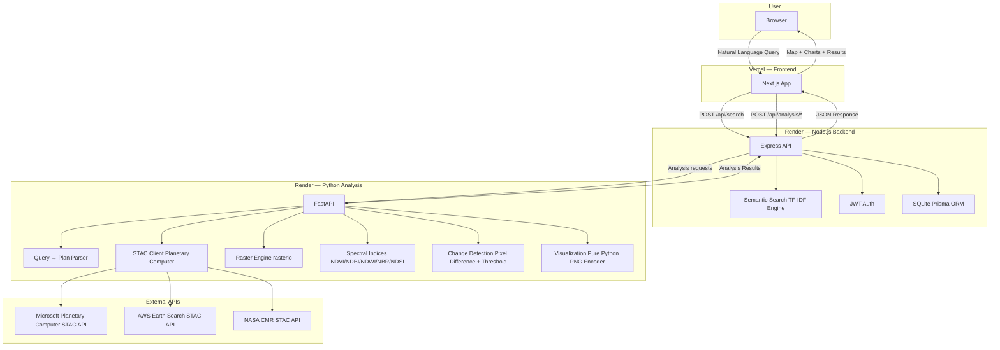
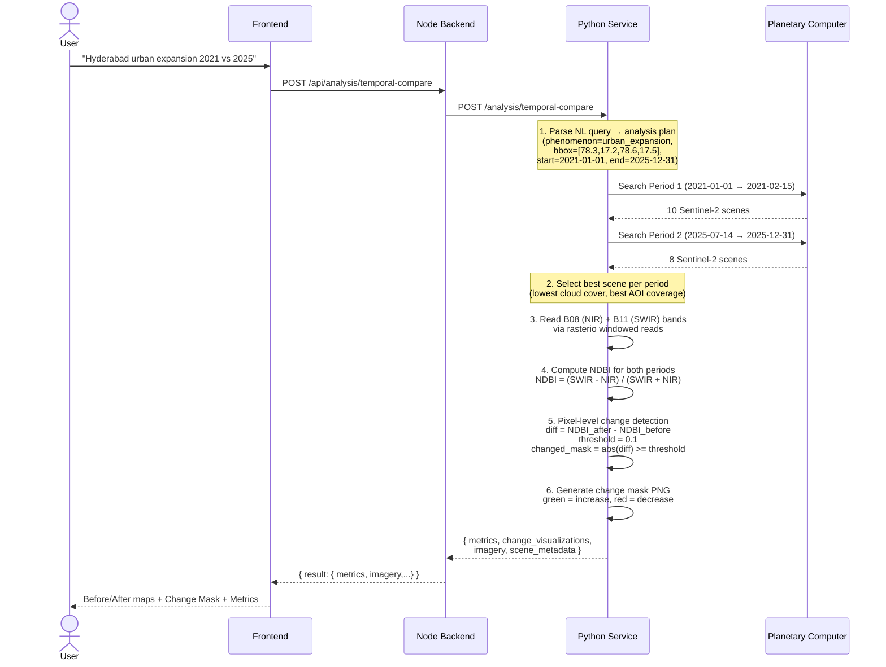
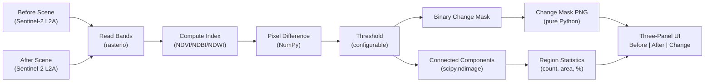
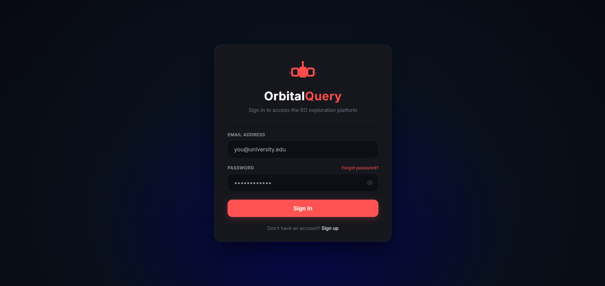
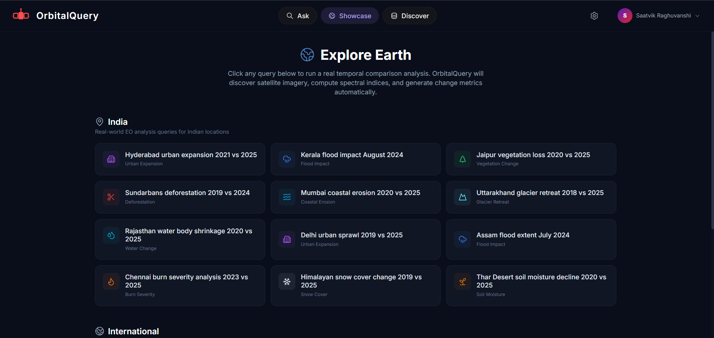
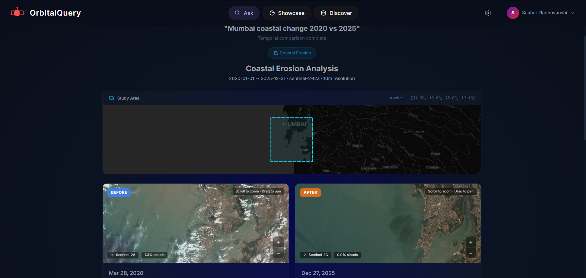
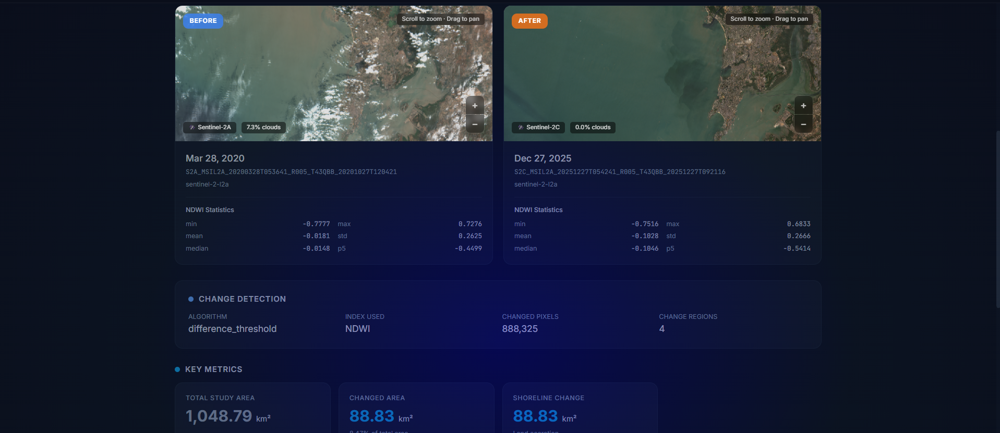
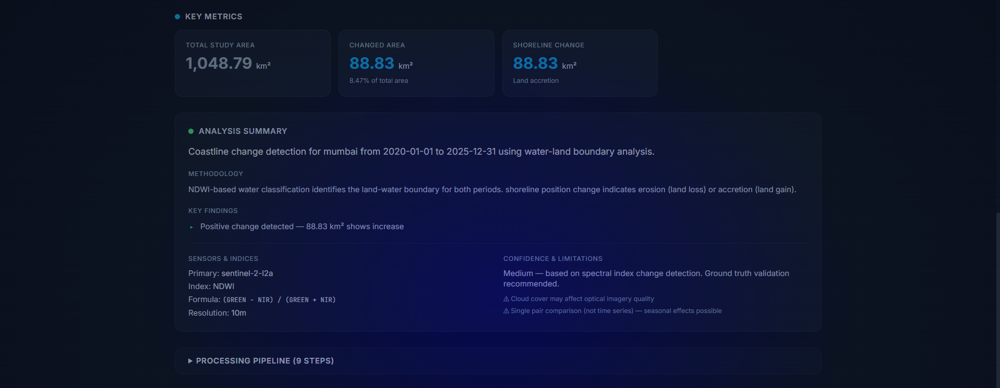
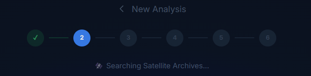

# OrbitalQuery — Semantic EO Dataset Explorer

A platform that enables researchers and decision-makers to **semantically query Earth Observation (EO) datasets** using natural language, geospatial filters, and time ranges. Combines semantic AI search with GIS visualization and a full change-detection analysis pipeline to make EO archives accessible without manual browsing.


---

OrbitalQuery is a semantic search engine for Earth Observation satellite datasets that lets researchers query archives using natural language (e.g., "deforestation near Assam 2015-2020") instead of manually browsing STAC catalogs — and unlike competitors like STAC Browser or Sentinel Hub, it combines AI-powered semantic search with a full analysis pipeline (temporal comparison, change detection, spectral indices) in a single zero-config platform, so you go from question to insight without switching tools.

> **Disclaimer:** OrbitalQuery is a research and exploration tool. It is **not intended for operational disaster response** or mission-critical decision-making. Always verify dataset accuracy and suitability through official sources before making policy or operational decisions.

---

## Working Links

### Local Development

| Service | URL | Description |
|---------|-----|-------------|
| **Frontend (UI)** | http://localhost:3000 | Main application — search bar, map, results |
| **Backend (API)** | http://localhost:3001 | REST API — search, auth, datasets |
| **Python Analysis** | http://localhost:8000 | FastAPI — STAC search, spectral indices, change detection |

### GitHub Repository

| Link | URL |
|------|-----|
| **Repository** | https://github.com/saatvikraghuvanshi-lab/OrbitalQuery |
| **Main Branch** | https://github.com/saatvikraghuvanshi-lab/OrbitalQuery/tree/main |

### API Endpoints

| Endpoint | Method | URL | Status |
|----------|--------|-----|--------|
| Health Check | GET | http://localhost:3001/api/health | Verified |
| Semantic Search | POST | http://localhost:3001/api/search | Verified |
| Temporal Comparison | POST | http://localhost:3001/api/analysis/temporal-compare | Verified |
| STAC Scene Search | POST | http://localhost:3001/api/analysis/search-scenes | Verified |
| Analysis Preview | POST | http://localhost:3001/api/analysis/preview | Verified |
| List Datasets | GET | http://localhost:3001/api/datasets | Verified |
| Dataset Stats | GET | http://localhost:3001/api/datasets/stats/overview | Verified |
| Python Health | GET | http://localhost:8000/health | Verified |
| Python STAC Search | POST | http://localhost:8000/stac/search | Verified |
| Python Temporal Compare | POST | http://localhost:8000/analysis/temporal-compare | Verified |

---

## Product Preview

<!--
PRODUCT SCREENSHOTS PLACEHOLDER
Add product screenshots here:
- docs/screenshots/orbitalquery-ask.png — Ask interface with natural language search
- docs/screenshots/orbitalquery-explore.png — Explore page with phenomenon categories
- docs/screenshots/orbitalquery-datasets.png — Dataset browser with map
- docs/screenshots/orbitalquery-analysis.png — Analysis pipeline in progress
- docs/screenshots/orbitalquery-before-after.png — Side-by-side satellite comparison
- docs/screenshots/orbitalquery-change-detection.png — Change mask visualization
-->

---

## Features

### Semantic Search
Query datasets using natural language (e.g., "deforestation near Assam 2015-2020"). The search engine tokenizes queries, removes stop words, expands terms, and ranks results using TF-IDF cosine similarity.

### Natural Language Analysis Pipeline
Type a question like "Hyderabad urban expansion 2021 vs 2025" and the system automatically:
1. Parses the query into a structured analysis plan (phenomenon, location, dates, sensor)
2. Discovers satellite scenes from STAC catalogs for both time periods
3. Selects optimal scenes based on cloud cover, spatial coverage, and temporal fit
4. Computes spectral indices from real Sentinel-2 band assets using rasterio
5. Runs pixel-level change detection between the two periods
6. Produces quantitative metrics with full provenance chain

### Pixel-Level Change Detection
The analysis engine computes actual change from satellite imagery:

| Mode | Method | Use Case |
|------|--------|----------|
| **Pixel Difference** | `abs(after - before)` per band | General change intensity |
| **NDVI Difference** | `NDVI_after - NDVI_before` | Vegetation loss/gain |
| **NDBI Difference** | `NDBI_after - NDBI_before` | Urban expansion |
| **NDWI Difference** | `NDWI_after - NDWI_before` | Water body change |
| **NBR / dNBR** | Burn ratio differencing | Wildfire burn severity |
| **NDSI Difference** | Snow index differencing | Glacier/snow retreat |

The pipeline includes:
- **Spatial alignment** — reprojects/resamples scenes onto a common pixel grid
- **Cloud/nodata masking** — excludes invalid pixels from change calculations
- **Configurable threshold** — classifies significant vs. insignificant change
- **Connected-component labeling** — counts distinct change regions via scipy.ndimage
- **Change mask visualization** — green = increase, red = decrease, transparent = stable
- **Difference visualization** — diverging blue-white-red colormap

### Spectral Indices
Compute NDVI, NDWI, NDBI, NBR, and NDSI from real Sentinel-2 band assets using rasterio and NumPy:

| Index | Formula | Bands Required | Use Case |
|-------|---------|----------------|----------|
| **NDVI** | `(NIR - RED) / (NIR + RED)` | B08, B04 | Vegetation health |
| **NDBI** | `(SWIR - NIR) / (SWIR + NIR)` | B11, B08 | Urban/built-up areas |
| **NDWI** | `(GREEN - NIR) / (GREEN + NIR)` | B03, B08 | Water body mapping |
| **NBR** | `(NIR - SWIR2) / (NIR + SWIR2)` | B08, B12 | Burn severity |
| **NDSI** | `(GREEN - SWIR1) / (GREEN + SWIR1)` | B03, B11 | Snow/ice cover |

### Temporal Comparison Views
Multiple visualization modes for before/after analysis:
- **Side by Side** — synchronized dual maps with independent satellite layers
- **Swipe** — draggable divider comparing two periods on stacked maps
- **Difference** — opacity-blended overlay of before and after imagery
- **Change Mask** — three-panel view: Before | After | Change Detection Overlay

### Annual Trend Charts
Interactive line charts showing index values across available observation years, enabling trend analysis and year-over-year comparison.

### Processing Pipeline Visualization
Real-time 8-stage pipeline display showing query interpretation, scene discovery, scene selection, spectral index computation, change detection, and metrics generation.

### Interactive Map
Leaflet.js map with dataset footprints, satellite imagery basemap, and bounding box drawing for spatial filtering.

### Multi-Source Dataset Discovery
Search across Sentinel-2, Landsat-8/9, Sentinel-1, MODIS, VIIRS, and NAIP collections from multiple providers.

### Authentication
JWT-based user authentication with role-based access control (researcher, admin).

### Security
Rate limiting, input sanitization, Helmet headers, CORS hardening, and production error handling.

---

## Change Detection Architecture

```
                    USER QUERY
                        │
                        ▼
                SCENE DISCOVERY
                   (STAC API)
                        │
               ┌────────┴────────┐
               │                 │
               ▼                 ▼
          BEFORE SCENE      AFTER SCENE
               │                 │
               └────────┬────────┘
                        ▼
                  COMPATIBILITY
                     CHECK
                        │
                        ▼
                 ALIGN / RESAMPLE
               (common pixel grid)
                        │
                        ▼
                  CLOUD MASKING
              (exclude nodata)
                        │
                        ▼
                CHANGE DETECTION
                   /         \
                  /           \
                 ▼             ▼
         PIXEL DIFFERENCE    SPECTRAL
                            INDEX Δ
                  \             /
                   \           /
                    ▼         ▼
                    CHANGE MASK
                        │
             ┌──────────┴──────────┐
             ▼                     ▼
       VISUALIZATION          STATISTICS
             │                     │
             └──────────┬──────────┘
                        ▼
                   CHANGE MAP
              (green = increase,
               red = decrease)
```

### Supported Phenomena

| Phenomenon | Index | Sensor | Analysis |
|-----------|-------|--------|----------|
| Urban Expansion | NDBI | Sentinel-2 | Built-up area growth detection |
| Vegetation Change | NDVI | Sentinel-2 | Greenness and health monitoring |
| Deforestation | NDVI | Sentinel-2 | Forest loss and gain |
| Flood Impact | NDWI + SAR | Sentinel-1/2 | Flood extent mapping |
| Water Body Change | NDWI | Sentinel-2 | Surface water monitoring |
| Burn Severity | NBR / dNBR | Sentinel-2 | Wildfire damage assessment |
| Glacier Retreat | NDSI | Sentinel-2 | Ice/snow extent change |
| Coastal Erosion | NDWI | Sentinel-2 | Shoreline position change |
| Snow Cover | NDSI | Sentinel-2 | Snow/ice cover monitoring |
| Soil Moisture | NDVI proxy | Sentinel-2 | Dryness and moisture assessment |

---

## Retrieval Validation

Benchmark queries run against the live analysis pipeline (Planetary Computer STAC + rasterio raster reads + change detection):

| Metric | Value |
|--------|-------|
| **Benchmark queries** | 5 |
| **Pipeline completion** | 5/5 (100%) |
| **Both scenes found** | 4/5 (80%) |
| **Raster-derived metrics** | 3/5 (60%) |
| **Median response time** | 6.3s |
| **Average response time** | 5.8s |

```
Query                                          Raster  Delta    Time
─────────────────────────────────────────────────────────────────
vegetation change Jaipur 2020 vs 2025          yes    -0.0568  6.4s
Sundarbans deforestation 2019 vs 2024          yes    -0.0325  7.7s
Hyderabad urban expansion 2021 vs 2025          no      0.0000  5.8s
Kerala flood impact August 2024                no      0.0000  3.0s
Delhi urban sprawl 2019 vs 2025                yes    +0.0639  6.3s
```

Raster-derived means the system read actual Sentinel-2 pixel data via rasterio, computed spectral indices (NDVI/NDBI), and ran pixel-level change detection. Non-raster results fall back to scene metadata estimation.

---

## Quick Start

No API keys, no external database, no complex setup. Just Node.js and Python.

### Prerequisites
- Node.js 18+ (`node --version`)
- Python 3.11+ (`python --version`)
- npm (`npm --version`)

### 1. Install and Run

```bash
# Clone
git clone https://github.com/saatvikraghuvanshi-lab/OrbitalQuery.git
cd OrbitalQuery

# Install backend
cd backend && npm install && cd ..

# Install frontend
cd frontend && npm install && cd ..

# Install Python analysis service
cd analysis-service && pip install -r requirements.txt && cd ..

# Start backend (Terminal 1)
cd backend && npm run dev

# Start frontend (Terminal 2)
cd frontend && npm run dev

# Start Python analysis service (Terminal 3)
cd analysis-service && uvicorn app.main:app --host 0.0.0.0 --port 8000
```

### 2. Open the App

- **Frontend**: http://localhost:3000
- **Backend API**: http://localhost:3001/api/health
- **Python Analysis**: http://localhost:8000/health

### 3. Load Real Data (216+ datasets from live STAC APIs)

```bash
# Ingest 216 real datasets from AWS Earth Search (Sentinel-2, Landsat, Sentinel-1, NAIP)
cd backend && npx ts-node src/scripts/ingest-real.ts --all --limit 50

# Or load sample data (16 curated datasets)
cd backend && npx ts-node src/scripts/ingest-sample.ts
```

### 4. Try It Out

Open http://localhost:3000 and try:
- "Deforestation near Assam 2015-2020"
- "Urban expansion in Jaipur"
- "Glacier retreat in Himalayas"
- "Hyderabad urban expansion 2021 vs 2025"
- "Sundarbans deforestation 2019 vs 2024"

---

## Python Analysis Service

The analysis service is a FastAPI microservice that handles all EO data processing.

### Architecture

```
analysis-service/
├── app/
│   ├── main.py                    # FastAPI application entry point
│   ├── routes/
│   │   ├── temporal_compare.py    # POST /analysis/temporal-compare
│   │   ├── stac.py                # POST /stac/search
│   │   └── health.py              # GET /health
│   ├── services/
│   │   ├── temporal_compare.py    # Main analysis pipeline orchestrator
│   │   ├── query_to_plan.py       # NL query → structured analysis plan
│   │   ├── capability_registry.py # Phenomena, sensors, thresholds
│   │   ├── spectral_indices.py    # NDVI, NDBI, NDWI, NBR, NDSI computation
│   │   ├── change_detection.py    # Pixel-level change detection
│   │   ├── raster_service.py      # Memory-optimized raster I/O (rasterio)
│   │   ├── eo_provider.py         # STAC catalog provider (Planetary Computer)
│   │   └── security.py            # Query sanitization
│   └── models/
│       └── requests.py            # Pydantic request/response models
├── requirements.txt
└── Dockerfile
```

### Key Design Decisions

**Memory-optimized for Render free tier (512MB):**
- Heavy imports (numpy, rasterio, scipy, planetary_computer) are deferred to function bodies
- GDAL environment variables are cleaned before each rasterio.Env() block to prevent TypeError
- Raster reads use small windows (512x512 pixels = ~1MB per band) to stay within memory limits
- Pure Python PNG encoder (no Pillow dependency) for change mask visualization

**STAC asset handling:**
- Handles pystac.Asset objects, plain dicts, and string URLs uniformly
- Falls back gracefully when band assets are unavailable

**Scene search resilience:**
- Auto-widens date windows (±90 days, then full year) when initial search returns 0 scenes
- Prevents common failure where narrow 45-day windows miss available satellite data

### Running Locally

```bash
cd analysis-service
pip install -r requirements.txt
uvicorn app.main:app --host 0.0.0.0 --port 8000
```

### Running with Docker

```bash
cd analysis-service
docker build -t orbitalquery-analysis .
docker run -p 8000:8000 orbitalquery-analysis
```

---

## Tech Stack

| Layer | Technology | Purpose |
|-------|-----------|---------|
| **Frontend** | Next.js 18 + TypeScript | React framework with SSR/SSG |
| **Styling** | Tailwind CSS | Utility-first CSS with dark theme |
| **Mapping** | Leaflet.js | Interactive maps + bounding box drawing |
| **Charting** | Recharts | Annual trend charts and data visualization |
| **Backend** | Node.js + Express | REST API gateway |
| **ORM** | Prisma | Type-safe database queries |
| **Database** | SQLite | Lightweight local database |
| **Analysis** | Python 3.11 + FastAPI | EO data processing microservice |
| **Raster I/O** | rasterio | Satellite imagery reading and windowed access |
| **Array Computing** | NumPy | Spectral index computation and change detection |
| **Region Labeling** | scipy.ndimage | Connected-component analysis for change regions |
| **STAC Client** | pystac-client + planetary_computer | Planetary Computer STAC catalog access |
| **Search** | TF-IDF (custom) | Semantic search engine |
| **Auth** | JWT + bcrypt | Token-based authentication |
| **Data API** | STAC (Planetary Computer, AWS, NASA) | Earth Observation data access |
| **Frontend Deploy** | Vercel | Serverless frontend hosting |
| **Backend Deploy** | Render | Container hosting with free tier |
| **Analysis Deploy** | Render | Python service with Docker |

---

## Architecture

### System Overview



### Analysis Workflow



### Change Detection Pipeline Detail



---

## Data Sources

### Live Datasets (ingested from AWS Earth Search STAC API)

| Collection | Resolution | Provider | Coverage |
|-----------|-----------|----------|----------|
| sentinel-2-l2a | 10m multispectral | Copernicus/ESA | Global, 5-day revisit |
| landsat-c2-l2 | 30m multispectral | USGS/NASA | Global, 16-day revisit |
| sentinel-1-grd | 10m SAR | Copernicus/ESA | Global, 6-day revisit |
| naip | 0.6m aerial | USDA | USA only |

### STAC Catalog Providers

| Provider | API | Role | Status |
|----------|-----|------|--------|
| **Microsoft Planetary Computer** | STAC + TileJSON | Temporal analysis, satellite imagery, tile rendering | Primary |
| **AWS Earth Search** | STAC API v1 | Dataset discovery, fallback provider | Active |
| **NASA Earthdata** | CMR STAC | MODIS/VIIRS/Landsat HLS data | Registered |
| **Copernicus CDSE** | STAC + OData | Sentinel family data | Registered |
| **ISRO Bhoonidhi** | WMS/WFS | Indian EO data | Registered |

### STAC API References

- **STAC Specification** — https://stacspec.org
- **AWS Earth Search STAC** — https://earth-search.aws.element84.com/v1
- **Microsoft Planetary Computer** — https://planetarycomputer.microsoft.com

---

## API Reference

### POST /api/analysis/temporal-compare

The primary analysis endpoint. Accepts a natural language query and returns full analysis results.

**Request:**
```json
{
  "query": "Hyderabad urban expansion 2021 vs 2025",
  "bbox": [78.3, 17.2, 78.6, 17.5],
  "start_date": "2021-01-01",
  "end_date": "2025-12-31"
}
```

**Response:**
```json
{
  "status": "ok",
  "plan": {
    "phenomenon": "urban_expansion",
    "analysis_type": "ndbi_change",
    "sensor": "sentinel-2-l2a",
    "bbox": [78.3, 17.2, 78.6, 17.5],
    "start_date": "2021-01-01",
    "end_date": "2025-12-31"
  },
  "result": {
    "scene_t1": { "item_id": "S2B_MSIL2A_20210112...", "datetime": "2021-01-12", "cloud_cover": 2.1 },
    "scene_t2": { "item_id": "S2C_MSIL2A_20250828...", "datetime": "2025-08-28", "cloud_cover": 0.3 },
    "index_t1": { "stats": { "mean": 0.045, "std": 0.12 } },
    "index_t2": { "stats": { "mean": 0.089, "std": 0.15 } },
    "change_detection": { "changed_pct": 12.4, "changed_pixels": 5420, "num_regions": 8 },
    "change_visualizations": { "change_mask_png": "<hex>", "difference_png": "<hex>" },
    "metrics": { "delta_index": 0.044, "direction": "increase", "raster_derived": true },
    "imagery": { "period1": { "tilejson": "..." }, "period2": { "tilejson": "..." } }
  }
}
```

### POST /api/search

Semantic search across the dataset catalog.

**Request:**
```json
{
  "query": "deforestation near Assam",
  "bbox": [91.0, 26.0, 92.5, 27.5],
  "startDate": "2020-01-01",
  "endDate": "2024-12-31",
  "limit": 20
}
```

---

## Security

| Feature | Implementation |
|---------|---------------|
| Authentication | JWT + bcrypt (12 rounds) |
| Rate Limiting | 100 req/15min (API), 30 searches/5min |
| Input Sanitization | SQL injection + XSS prevention |
| Security Headers | Helmet.js (CSP, HSTS) |
| CORS | Restricted origin with preflight caching |
| Error Handling | Stack traces hidden in production |

---

## Testing

### Stress Test (k6)

```bash
# Install k6: https://k6.io/docs/get-started/installation/
cd backend
k6 run stress-test/k6-search.js
```

### Postman Collection

Import `backend/stress-test/postman-collection.json` into Postman for pre-configured API tests.

---

## Project Structure

```
OrbitalQuery/
├── analysis-service/              # Python FastAPI — EO analysis engine
│   ├── app/
│   │   ├── main.py                # FastAPI application
│   │   ├── routes/
│   │   │   ├── temporal_compare.py  # Temporal comparison endpoint
│   │   │   ├── stac.py              # STAC catalog search
│   │   │   └── health.py            # Health check
│   │   ├── services/
│   │   │   ├── temporal_compare.py  # Analysis pipeline orchestrator
│   │   │   ├── query_to_plan.py     # NL query → analysis plan
│   │   │   ├── capability_registry.py # Phenomena, sensors, thresholds
│   │   │   ├── spectral_indices.py  # NDVI, NDBI, NDWI, NBR, NDSI
│   │   │   ├── change_detection.py  # Pixel-level change detection
│   │   │   ├── raster_service.py    # Memory-optimized raster I/O
│   │   │   └── eo_provider.py       # STAC catalog provider
│   │   └── models/
│   │       └── requests.py          # Pydantic models
│   ├── requirements.txt
│   ├── Dockerfile
│   └── start.sh
├── backend/                       # Node.js Express — REST API gateway
│   ├── prisma/schema.prisma       # SQLite schema
│   ├── src/
│   │   ├── index.ts               # Express server
│   │   ├── routes/
│   │   │   ├── search.ts          # Semantic search
│   │   │   ├── datasets.ts        # Dataset CRUD
│   │   │   ├── auth.ts            # JWT authentication
│   │   │   └── analysis.ts        # Python service gateway
│   │   ├── services/
│   │   │   ├── python-client.ts   # HTTP client for Python service
│   │   │   ├── search-engine.ts   # TF-IDF semantic search
│   │   │   └── semantic.ts        # Query expansion
│   │   └── scripts/
│   │       ├── ingest-real.ts     # Live STAC ingestion
│   │       └── ingest-sample.ts   # Sample data loader
│   └── stress-test/
├── frontend/                      # Next.js — React application
│   ├── app/
│   │   ├── page.tsx               # Main Ask/Explore/Datasets page
│   │   └── docs/research/         # Research report page
│   ├── components/
│   │   ├── Header.tsx             # Navigation
│   │   ├── QueryInput.tsx         # Search input
│   │   ├── MapView.tsx            # Leaflet map
│   │   ├── TemporalComparisonView.tsx  # Before/after/change views
│   │   ├── SwipeMap.tsx           # Swipe comparison
│   │   ├── AnalysisStepper.tsx    # Pipeline progress
│   │   ├── TerminalLog.tsx        # Processing log
│   │   ├── RechartsTrendChart.tsx # Annual trend chart
│   │   └── AnalysisErrorScreen.tsx
│   ├── hooks/
│   │   └── useAnalysis.ts         # Analysis state management
│   ├── lib/
│   │   └── satellite-tiles.ts     # Planetary Computer tile loading
│   └── vercel.json
├── docs/
│   ├── EVALUATION-REPORT.md
│   ├── SECURITY-REPORT.md
│   ├── architecture.md
│   └── screenshots/
└── README.md
```

---

## Screenshots

<table>
<tr>
<td align="center"><b>Ask — Natural Language Search</b><br/></td>
<td align="center"><b>Explore — Phenomenon Browser</b><br/></td>
</tr>
<tr>
<td align="center"><b>Analysis Pipeline — Processing Steps</b><br/></td>
<td align="center"><b>Before / After — Satellite Comparison</b><br/></td>
</tr>
<tr>
<td align="center"><b>Change Detection — Results</b><br/></td>
<td align="center"><b>Full Analysis — Complete</b><br/></td>
</tr>
</table>

---

## Deployment

### Backend (Render)

1. Push to GitHub
2. Create Web Service on https://render.com
3. Build: `cd backend && npm install && npx prisma generate`
4. Start: `cd backend && node dist/index.js`
5. Set env: `JWT_SECRET`, `CORS_ORIGIN`, `PYTHON_SERVICE_URL`

### Python Analysis Service (Render)

1. Create Web Service on https://render.com
2. Runtime: Python 3.11
3. Build: `cd analysis-service && pip install -r requirements.txt`
4. Start: `cd analysis-service && uvicorn app.main:app --host 0.0.0.0 --port $PORT`
5. Set env: `PYTHON_SERVICE_URL` in Node.js backend to point to this service

### Frontend (Vercel)

1. Push to GitHub
2. Import on https://vercel.com
3. Root directory: `frontend`
4. Set env: `NEXT_PUBLIC_API_URL=<your-backend-url>`

### Full Deployment Guide

See [DEPLOY.md](DEPLOY.md) for complete deployment instructions.

---

## Research and Documentation

Research Document: [ORBITALQUERY_RESEARCH_REPORT.docx](https://github.com/user-attachments/files/31349935/ORBITALQUERY_RESEARCH_REPORT.docx)

| Document | Description |
|----------|-------------|
| [Research Report](/docs/research) | Technical research covering EO data sources, analysis methods, and system architecture |
| [EVALUATION-REPORT.md](docs/EVALUATION-REPORT.md) | Evaluation findings — 55/55 tests pass |
| [SECURITY-REPORT.md](docs/SECURITY-REPORT.md) | Security assessment |
| [architecture.md](docs/architecture.md) | Architecture documentation |
| [DEPLOY.md](DEPLOY.md) | Deployment guide |

---

## Contribution and Repository Safety

### Rules

1. **Never push directly to main.**
2. **Never force push to main.**
3. **Never delete main.**
4. **Never rewrite existing repository history.**
5. **Never modify existing APIs, URLs, datasets, architecture, environment variables, or configuration without documenting the reason.**
6. **Never remove existing functionality simply to make a new feature work.**
7. **Never replace a working implementation without first understanding its dependencies.**
8. **Never commit secrets, API keys, tokens, passwords, credentials, .env files, or private data.**
9. **Never commit large satellite datasets or generated imagery unless explicitly approved.**
10. **Never blindly merge AI-generated code.**
11. **Every AI-generated change must be reviewed by a human.**
12. **Every feature must be developed on its own branch.**
13. **Every branch must be submitted through a Pull Request.**
14. **Every Pull Request must explain:**
    - What changed
    - Why it changed
    - Files affected
    - Dependencies added
    - APIs/datasets affected
    - How it was tested
    - Known limitations
15. **If a change could break existing functionality, discuss it before merging.**
16. **If unsure, do not delete or overwrite. Ask the repository owner first.**

---

## License

MIT License
