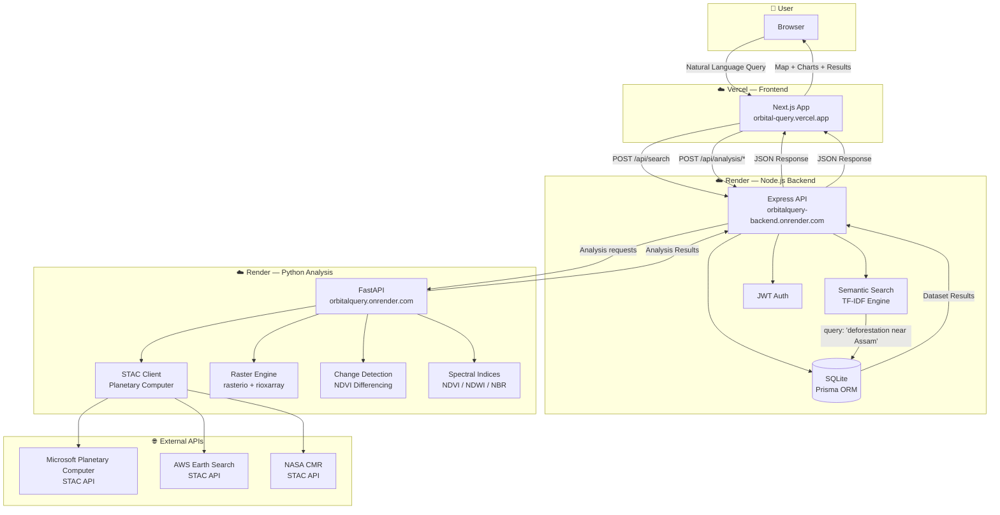
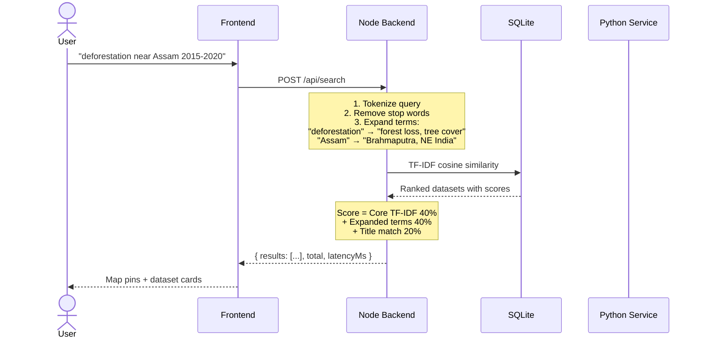
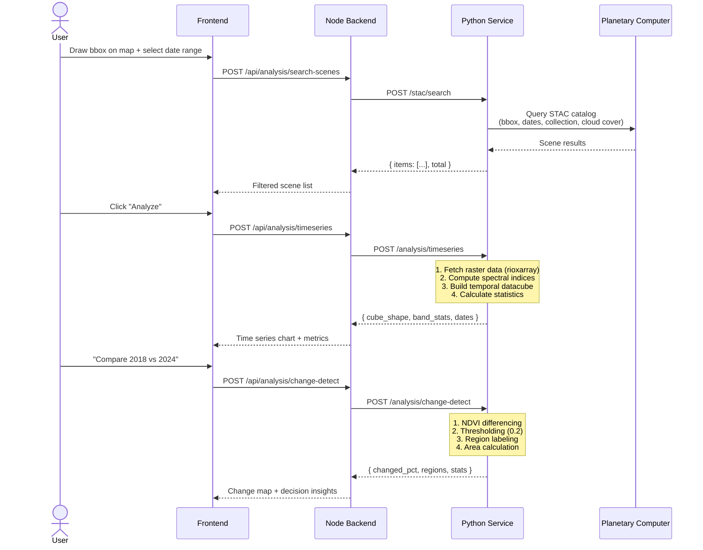
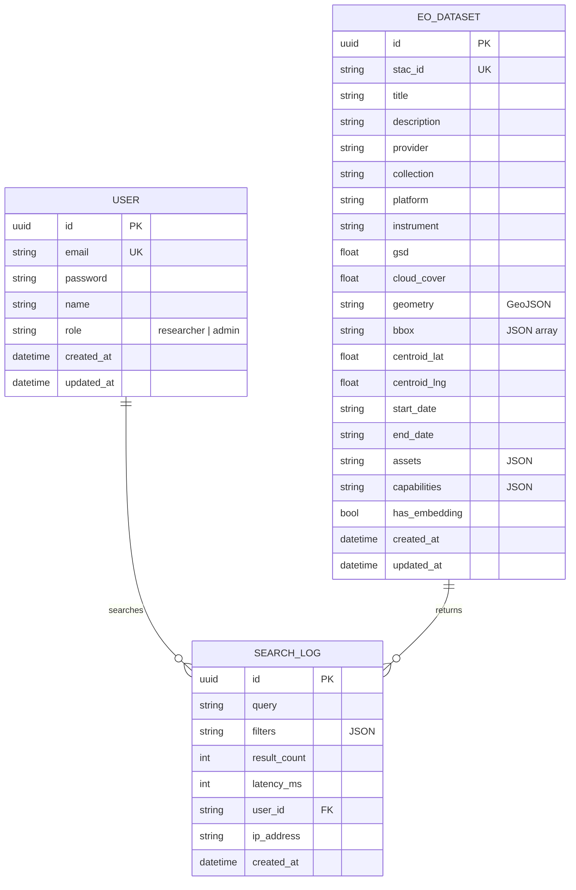

# OrbitalQuery — Architecture & Workflow

---

## 🏗️ Project Structure

```
OrbitalQuery/
├── frontend/                    # Next.js 18 + TypeScript
│   ├── app/                     # App Router (pages)
│   │   ├── page.tsx             # Landing / Ask page
│   │   ├── showcase/            # Showcase tab
│   │   └── discover/            # Dataset browser tab
│   ├── components/              # React components
│   │   ├── SearchBar.tsx        # Natural language search input
│   │   ├── MapView.tsx          # Leaflet.js interactive map
│   │   ├── DatasetCard.tsx      # Dataset result cards
│   │   └── AnalysisPanel.tsx    # Analysis results display
│   ├── hooks/                   # Custom React hooks
│   ├── lib/                     # Utilities & API client
│   ├── public/                  # Static assets
│   ├── next.config.js           # Next.js config + API rewrites
│   ├── vercel.json              # Vercel deployment config
│   └── package.json
│
├── backend/                     # Node.js + Express + TypeScript
│   ├── src/
│   │   ├── index.ts             # Express server entry point
│   │   ├── routes/
│   │   │   ├── search.ts        # POST /api/search (semantic TF-IDF)
│   │   │   ├── datasets.ts      # GET /api/datasets (SQLite CRUD)
│   │   │   ├── auth.ts          # JWT authentication
│   │   │   ├── ingest.ts        # Dataset ingestion endpoints
│   │   │   └── analysis.ts      # Python service gateway routes
│   │   ├── services/
│   │   │   ├── python-client.ts # HTTP client for Python service
│   │   │   ├── stac-search.ts   # STAC catalog search logic
│   │   │   └── semantic.ts      # TF-IDF semantic search engine
│   │   ├── middleware/
│   │   │   ├── auth.ts          # JWT verification middleware
│   │   │   ├── rate-limit.ts    # Express rate limiter
│   │   │   └── request-id.ts    # Request ID tracking
│   │   └── scripts/
│   │       ├── ingest-real.ts   # Ingest from live STAC APIs
│   │       └── ingest-sample.ts # Seed sample datasets
│   ├── prisma/
│   │   ├── schema.prisma        # Database schema (User, EODataset, SearchLog)
│   │   ├── migrations/          # SQLite migration files
│   │   └── dev.db               # Local SQLite database
│   └── package.json
│
├── analysis-service/            # Python 3 + FastAPI
│   ├── app/
│   │   ├── main.py              # FastAPI app entry point
│   │   ├── routes/
│   │   │   ├── stac.py          # /stac/search — STAC catalog queries
│   │   │   ├── timeseries.py    # /analysis/timeseries — temporal datacubes
│   │   │   ├── change.py        # /analysis/change-detect — change detection
│   │   │   ├── preprocess.py    # /analysis/preprocess — data preprocessing
│   │   │   ├── spectral.py      # /analysis/index — spectral indices (NDVI, NDWI, etc.)
│   │   │   ├── flood.py         # /analysis/flood/assess — flood impact
│   │   │   ├── explain.py       # /analysis/explain — deterministic explanations
│   │   │   ├── query.py         # /analysis/query/plan — NL query → analysis plan
│   │   │   └── health.py        # /health — service health check
│   │   ├── services/
│   │   │   ├── stac_client.py   # Planetary Computer / STAC API client
│   │   │   ├── raster.py        # rasterio / rioxarray operations
│   │   │   ├── change_detection.py # NDVI differencing, thresholding
│   │   │   ├── spectral_indices.py # Band math for indices
│   │   │   └── temporal.py      # Time series construction
│   │   └── models/              # Pydantic request/response models
│   └── requirements.txt
│
└── docs/
    ├── architecture.md          # This file
    └── ORBITALQUERY_RESEARCH_REPORT.docx
```

---

## 🔄 System Workflow Diagram



---

## 🔍 Search Workflow (Semantic TF-IDF)



---

## 🛰️ Analysis Workflow (Python Service)



---

## 🗄️ Database Schema



---

## 🌍 Deployment Architecture

```
┌──────────────────────────────────────────────────────────────────┐
│                        DEPLOYMENT MAP                            │
├──────────────────────────────────────────────────────────────────┤
│                                                                  │
│  ┌─────────────────┐     ┌──────────────────┐                   │
│  │     Vercel       │     │     Render        │                   │
│  │                  │     │                   │                   │
│  │  ┌────────────┐ │     │  ┌──────────────┐ │                   │
│  │  │  Next.js    │ │────▶│  │  Node.js     │ │                   │
│  │  │  Frontend   │ │     │  │  Express API │ │                   │
│  │  │  Port 3000  │ │     │  │  Port 3001   │ │                   │
│  │  └────────────┘ │     │  └──────┬───────┘ │                   │
│  └─────────────────┘     │         │         │                   │
│                          │  ┌──────▼───────┐ │                   │
│                          │  │  Python      │ │                   │
│                          │  │  FastAPI     │ │                   │
│                          │  │  Port 8000   │ │                   │
│                          │  └──────┬───────┘ │                   │
│                          │         │         │                   │
│                          │  ┌──────▼───────┐ │                   │
│                          │  │  SQLite DB   │ │                   │
│                          │  │  (Prisma)    │ │                   │
│                          │  └──────────────┘ │                   │
│                          └──────────────────┘                   │
│                                  │                               │
│                          ┌───────▼────────┐                     │
│                          │  External APIs  │                     │
│                          │  • Planetary    │                     │
│                          │    Computer     │                     │
│                          │  • AWS Earth    │                     │
│                          │    Search       │                     │
│                          │  • NASA CMR     │                     │
│                          └────────────────┘                     │
│                                                                  │
└──────────────────────────────────────────────────────────────────┘
```
